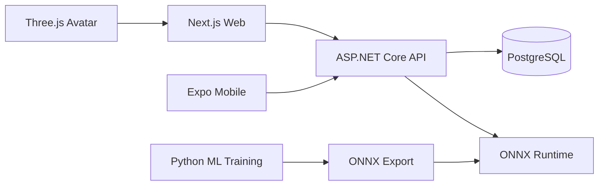

# Architecture

ISHARA uses a modular monorepo with one backend serving multiple clients.

## Backend

The backend follows Clean Architecture boundaries:

- `Ishara.Domain`: entities, value objects, domain rules.
- `Ishara.Application`: use cases, interfaces, DTOs, validation.
- `Ishara.Infrastructure`: persistence, external integrations, model inference implementations.
- `Ishara.Api`: HTTP endpoints, auth, SignalR hubs, OpenAPI, configuration.

Phase 2 backend infrastructure includes:

- JSON console logging through the built-in .NET logging stack.
- RFC 7807 problem details for unexpected API errors.
- Live and readiness health endpoints.
- EF Core PostgreSQL registration through `IsharaDbContext`.
- Initial EF Core migration baseline. The baseline contains no tables because Phase 2 has not introduced domain entities yet.
- OpenAPI document generation in development.

## AI Boundary

Python is used for research, training, preprocessing, and evaluation. Production inference should use exported ONNX models through the .NET backend.

## Privacy Boundary

Raw video should not be uploaded continuously. Prefer local landmark extraction, short explicit-consent clips for dataset collection, or event-based inference payloads.
